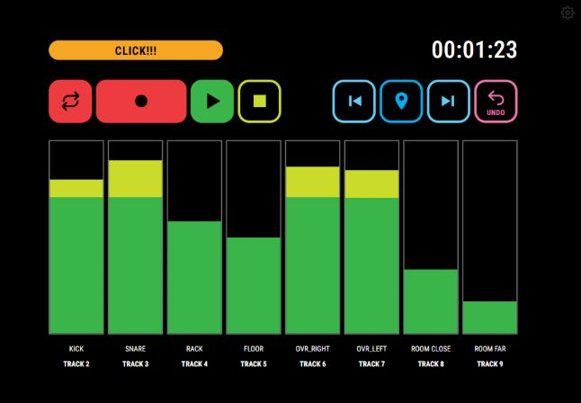
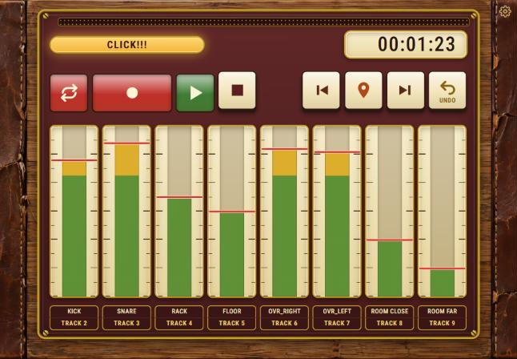
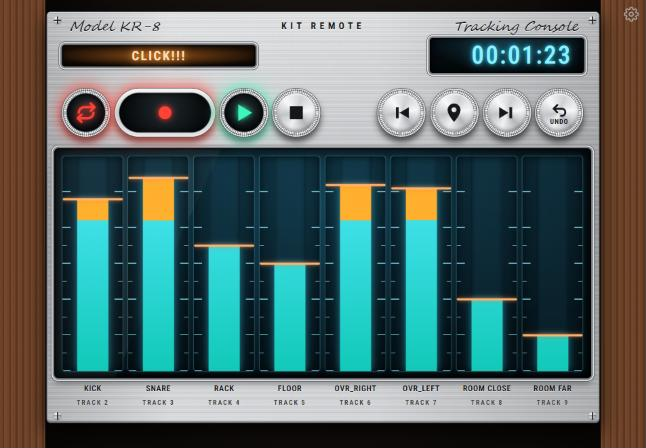
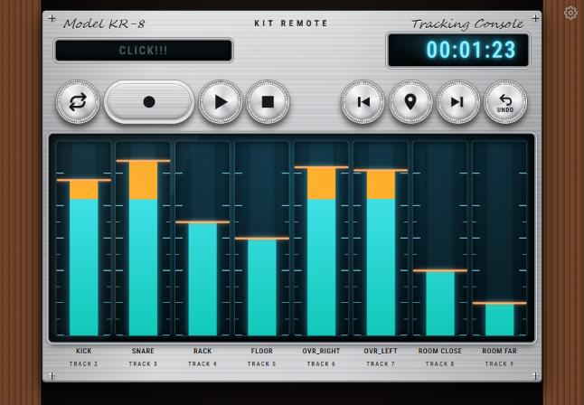
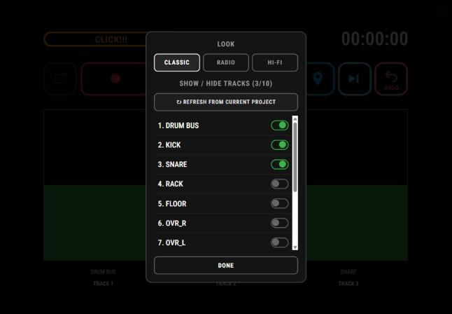
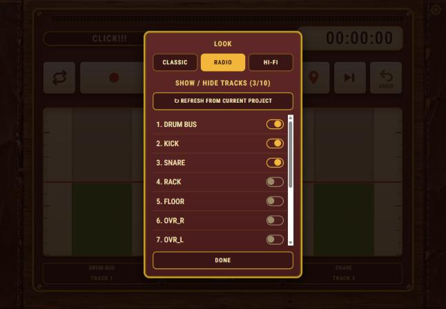
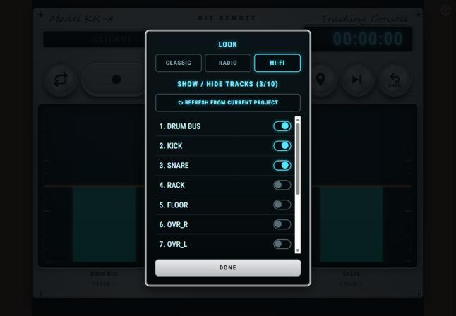

# REAPER Kit Remote

A glanceable tracking remote for REAPER, built for a tablet mounted at a drum kit. Big transport keys, a metronome toggle, a live timecode and per-track level meters, readable from about three feet away. It is **not a mixer**: no EQ, panning or FX control.

It is a single static web page that talks to REAPER's built-in web server. There is no install, no build step and no extension.

## Looks

Three switchable looks (tap the gear icon, then **LOOK**). Your choice is remembered on that device.

| CLASSIC (default) | RADIO | HI-FI |
|---|---|---|
|  |  |  |
| Black, high-contrast outline buttons | Vintage radio: maroon faceplate, brass trim, cream piano keys and dial-window meters, on wood | Silver brushed-aluminum faceplate, chrome knurled knobs, black glass windows lit blue-green |

HI-FI idle (nothing lit) and the settings panel in each look:

| HI-FI idle | Settings: Classic | Settings: Radio | Settings: Hi-fi |
|---|---|---|---|
|  |  |  |  |

(Screenshots use simulated meter data.)

## What it does

**Transport**
- Play/stop toggle, a dedicated Stop, Record, and a Loop (repeat) toggle.
- Jump to the previous or next marker (or the start or end of the project).
- Insert a marker at the current position, and Undo.
- Persistent states (play, record, loop, metronome) light up from REAPER's *confirmed* state, so they stay correct even if something else (keyboard, footswitch) changes transport.
- One-shot buttons (stop, rewind, forward, marker, undo) flash on press.

**Display**
- Live timecode, formatted as HH:MM:SS from the raw position, so it ignores the project's ruler format.
- A metronome toggle ("CLICK!!!") that reflects REAPER's actual on/off state.
- Up to 10 vertical level meters with live track names. The colour zones sit at fixed dB levels (-60 to 0 dB, with the upper zones marking the loud end), and a level line rides the top of each meter.
- Track labels always show the **real REAPER track number**, so they match your mixer.

**Track picker (gear icon)**
- Lists every track in the *currently active* project, with real names, and lets you choose up to 10 to display. The columns reflow to fill the width.
- Switching project tabs in REAPER updates the list automatically, and tracks the current project doesn't have are dropped.
- **Refresh from current project** button: a hard reset that forgets everything gathered so far and re-reads the active project.
- Your selection is stored in the browser (localStorage), so no code edits are needed between sessions.

**Layout**
- Fixed 1180x820 stage that scales to fit any screen with no scrolling. Meta tags allow "Add to Home Screen" for a full-screen launch on iPad.
- All fonts are self-hosted (Roboto Condensed, variable WOFF2). Nothing is loaded from the internet.

## Setup

1. **Enable REAPER's web control surface** (if not already on): Options → Preferences → Control/OSC/Web → Add → "Web browser interface". Pick a port (8080 is the usual) and set the default page to `index.html`.
2. **Copy these into your REAPER resource path's `reaper_www_root` folder** (Options → "Show REAPER resource path in explorer/finder"):
   - `index.html`, `main.js`, the `fonts/` folder, and `Background-Wood.jpg` (only the RADIO look uses it).
3. **Find your computer's LAN IP** (`ipconfig` on Windows, System Settings → Network on Mac).
4. On the tablet, same WiFi, open `http://<your-computer's-IP>:8080/`.
5. iOS: Share → **Add to Home Screen** to launch full-screen.

All the actions it triggers (play/stop, stop, record, repeat, previous/next marker, undo, insert marker, metronome) are **REAPER built-in action IDs**, identical on every REAPER install. Nothing to reconfigure.

## Customizing

- **Colors and look**: each look has its own scoped block in the `<style>` section (`html[data-skin="classic"]`, `"retro"`, `"hifi"`); colors are CSS variables at the top of each block.
- **Default look**: `classic`; change the fallback in the small script at the top of `<head>`. A `?skin=retro` (or `hifi`, `classic`) in the URL also selects and saves a look.
- **Insert-marker action**: `ACTIONS.marker` near the bottom of `index.html` (`40157`, "Markers: Insert marker at current position").
- **Max tracks shown**: `MAX_VISIBLE` (default 10; the layout was designed for up to 10 columns).

## Repository contents

| Path | What |
|---|---|
| `index.html` | The whole page, including all three looks |
| `main.js` | REAPER's own web-remote helper, unmodified |
| `fonts/` | Roboto Condensed variable WOFF2 (open source) |
| `Background-Wood.jpg` | Wood texture for the RADIO look |
| `spec-export.jsx` | Illustrator ExtendScript that exports named layers, groups and text frames to JSON (percent geometry, fill/stroke hex, text and font) |
| `docs/design/` | The Illustrator mockup exports and the spec JSON the layout was built from |
| `docs/screenshots/` | Screenshots used above |
| `docs/DEVELOPMENT_NOTES.md` | Architecture, protocol notes, style specs for each look, and the backlog |

## Building your own design

1. Design the layout in Illustrator and name each layer, group and text frame as you want it referenced (for example `transport-play`, `track-1-meter`). Give text frames an explicit name, because Illustrator shows an unnamed text frame's contents in the Layers panel without actually naming it.
2. Run `spec-export.jsx` (File → Scripts → Other Script...). It writes a JSON file next to your `.ai` with each item's position (percent of the artboard), fill/stroke colour and text/font info. Gradients, spot colours and corner radii are not exported.
3. Use that JSON as the spec for hand-written HTML/CSS.

## Known limitations

- No "disconnected from REAPER" banner yet.
- No clip-warning light. REAPER's web protocol gives a level but no clip flag, so it would need to be latched in JavaScript.
- No project name display: the web protocol doesn't expose one.
- No authentication on REAPER's web server: anyone on the same network who knows the URL can control transport. Fine for a home studio. Don't port-forward it to the internet.
- The HI-FI and RADIO looks use shadows and gradients heavily and have only been checked in a desktop preview with simulated data, not yet on a physical iPad.

Look inspiration came from vintage hi-fi and radio gear. No manufacturer's logos or wordmarks are used.
